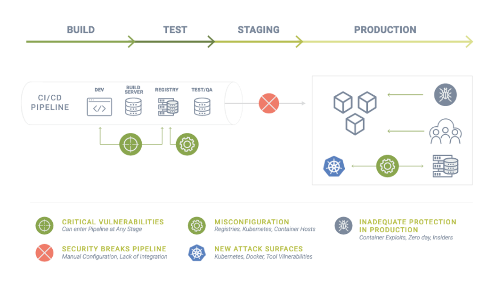

## Introduction

Many of us have seen this scene play out several times over.  Customer financial records have been exposed, account numbers have been hacked.  Security and compliance in a modern-day cloud-native is not only a requirement it is a challenge to most developers at enterprise companies.  There are many different parts to a container-based workload.  As a result, this increases the attack surface of an application and its infrastructure. The increased attack surface of container infrastructures makes security even more important, however, security and DevOps teams can’t afford to slow the pipeline with manual processes.  It takes a broad array of cloud-native security capabilities to successfully integrate security into the CI/CD pipeline, including into the production environment.

The critical infrastructure such as the container orchestrator Kubernetes, run-time CRI-O or containerd, and supporting infrastructure such as registries are all attack surfaces. Hackers are only now seeing the explosion of containers in production as ripe targets to launch zero-day attacks. The rapid evolution and lack of widespread operational experience of the cloud-native tools means containers will not become battle-tested and attack resistant for many years.

New cloud-native tools such as registries, orchestrators (Kubernetes), service meshes and other open source tools introduce new attack surfaces that are not known to either security or DevOps teams. New concepts such as **infrastructure as code** and **security policy as code** will require collaboration between DevOps and security teams in order to enable automation of pipelines in a secure environment. 

To implement a layered security approach for containers, start from the 'left-side,’ of development with vulnerability and compliance scanning. Then, progress to the right with real-time network, container, and host protections. Vulnerability scanning without virtual patching will overwhelm teams with non-actionable data, and run-time security without vulnerability and compliance management in the pipeline will increase the risk of damaging attacks penetrating the production environment.  This blog introduces an article 2-part series that discusses security issues facing DevOps and security teams and identifies ten integration points where container security can be automated into the pipeline.

## The CI/CD Pipeline Attack Surface

Before we look at automating container security, let’s understand why security is so critical to container and Kubernetes pipelines. From the beginning of the CI/CD pipeline into production, there are attack points where security can be comprised. The diagram below provides a summary of the most important critical security issues which keep DevOps and security teams awake at night.

#### Properly addressing these security concerns should be the primary focus for integrating security into the pipeline

* Critical Vulerablities: introduced uring the build phase, registraty and even in teh production environment

* Security Breaks Pipeline: adding manual steps for security reviews can slow or even stop the continuous integration and release of new or updated applications

* Misconfiguration: Need constant auditing of configurations who avoid compromising security and exposing containers open to attacks

* New Attack Surfaces: Hackers are only now seeing the explosion of containers in production as ripe targets to launch zero-
day attacks. 

* Inadequate Protection in Production: One needs to protect sensitive data or valuable assets with run-time security with deep network and endpoint (containers, host) protection

## 10 Steps to Container Security Automation - A Summary

In this series we’ll take a detailed look at ten integration points which can serve as a guide for 10 steps for container security automation. While there are many more than ten, these are highlighted as first steps because they are simple and impactful for improving security. Here’s a summary of these, followed by a pipeline reference diagram.

1. **Build-Phase Scanning**

Container images should be scanned for vulnerabilities and compliance violations during the build phase so the build step can be stopped (failed) in order to force correction or remediation. Integration is made easy through plug-ins and extensions for popular tools such as Jenkins, CircleCI, Azure DevOps, Gitlab, Bamboo etc.

2. ** Registry Scanning **

After images pass build-phase scanning, they are staged into registries and should also be scanned there. New vulnerabilities can be discovered or introduced after images are pushed to registries. Registry scan results can also be linked to Admission Controls (see #7 below) to prevent unauthorized or vulnerable images from being deployed.

3. **Production Scanning, CIS Benchmarks & Compliance Auditing**

Scanning and auditing should extend into the staging and production environments with run-time vulnerability scans and running of CIS benchmarks for Kubernetes and Docker, as well as any custom compliance checks.

4. **Risk Reporting and Vulnerability Management**

Although addressing high risk environments and interpreting vulnerability management reports typically involve some manual review, alerting and correlation can be done automatically to speed and ease assessment and remediation.

5. **Security Policy as Code**

Defining and deploying security rules for new applications can be automated as code in the same way that Kubernetes supports deployment manifests in standard yaml files. In this way, new or updated workloads are automatically protected as they are deployed to production.

6. **Application Behavioral Learning**

Behavioral learning is an important technique for automatically characterizing application behavior such as network connections, protocols used, processes required and file access activity allowed. We will see later how this can work together with Security Policy as Code (#5) to automate run-time security from dev to production.

7. **Admission Controls**

Admission controls are an important bridge between the CI/CD pipeline and the production environment. Once rules are established, vulnerable or unauthorized deployments can be automatically prevented.

8. **Container Network Firewall**

A layer 7 (application layer) container firewall will automatically enforce network segmentation by blocking network attacks and unauthorized connections. The creation and maintenance of these whitelist network rules can be automated as code (#5) utilizing behavioral learning (#6).

9. **Container Workload & Host (Endpoint) Security**

Containers and hosts should be continuously monitored for suspicious and unauthorized behavior such as processes and file activity. These activities can be automatically blocked. The creation and maintenance of these whitelist rules can be automated as code (#5) utilizing behavioral learning (#6).

10. Alerting, Response, and Forensics**

Finally, automated alerting, response, and forensic capture can be initiated for suspicious activity. These should include quarantine of containers, packet captures, and custom notifications to case management systems.

Now you are ready to dive into the deatils.  Again, this is an introduction to a 2 part-series:

* [Automating Container Security Into the CI/CD Pipeline - DEVOPS Point of View](https://github.ibm.com/ibm-developer-eti-ai-analytics/TenStepstoAutomateContainerSecurity-Pt1)

* [Automating Container Security Into the CI/CD Pipeline - Operations/Security Point of View](https://github.ibm.com/ibm-developer-eti-ai-analytics/TenStepstoAutomateContainerSecurity-Pt2)

Want to learn more?

<Add RELATED CONTENT>

